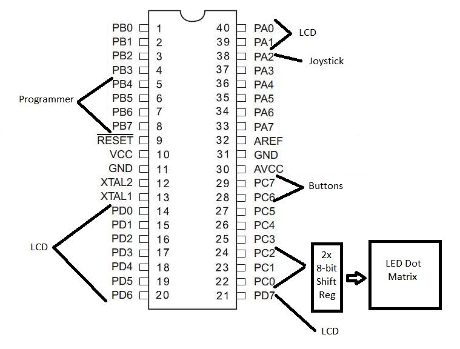
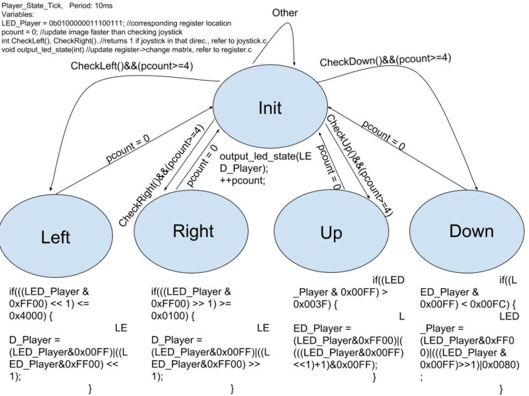
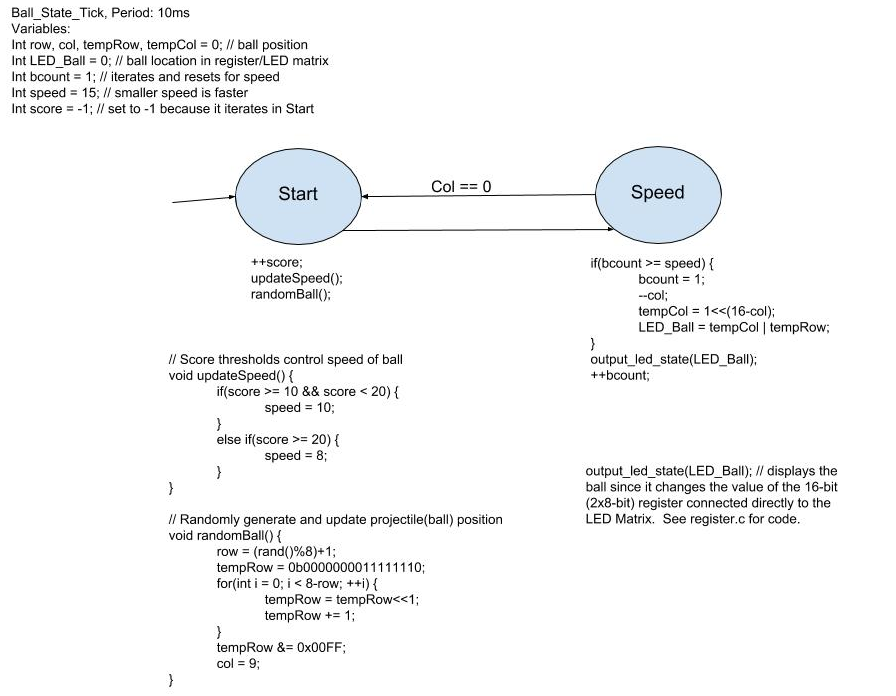
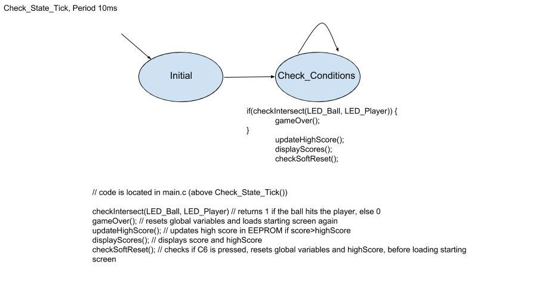

# Ball Dodger

## Introduction

Ball Dodger is a game that tests a users reaction time.  The user controls a rectangle using a joystick.  He/She can move up, down, left, or right.  The objective of the game is to dodge the falling balls/projectiles.  As time proceeds, the balls fall more frequently.  If the player is hit by a falling ball, he loses.  The final score is relative to how many balls have been evaded.

[Project Demo Link](https://www.youtube.com/watch?v=HbFBdjbKJ-g)

## Hardware

* ATMega1284p microcontroller
* 2 - 8-bit Shift Registers
* 8x8 LED Matrix
* Buttons
* Joystick
* 16x2 LCD Screen

## Software Complexities

* Integrating and calibrating the joystick with the ATmega's Analog-Digital Converter
* Using EEPROM to save the high score (balls dodged)
* Implementing 8-Bit 74HC595 Shift Registers 
* LED Matrix controlled by shift registers
* Handling collision between ball and player

## Pinout

## Concurrent Synchronous State Machines

## Built With

* Atmel Studio 7.0 (Integrated Development Platform)
* C (Language)

## File Descriptions

* io.c: handles LCD screen output
* joystick.c: reads ADC(analog-digital converter) for the joystick's axes
* register.c: changes the value of the two 8-bit registers connected to the LED matrix
* timer.h: utilizes <avr/interrupt.h> to setup the scheduler in main.c
* main.c: implementation of the state machines

## License

This project is licensed under the GNU General Public License v3.0.  See "LICENSE" for details.

